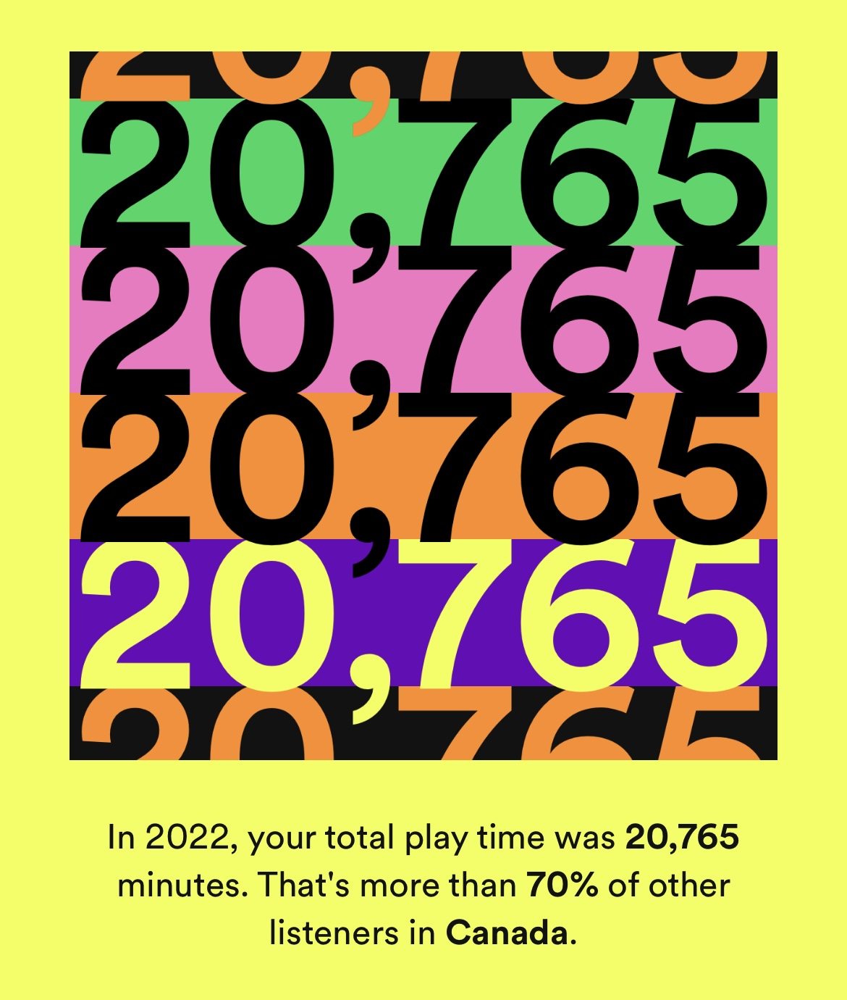

```{r, include = FALSE}
knitr::opts_chunk$set(
  collapse = TRUE,
  comment = "#>"
)
```
It goes without saying that music is an important aspect of many people's lives. Personally, I spend an inordinate amount of time on Spotify. I like to listen to music on the shuttle, in the gym, when I'm walking, doing chores, working, breathing, etc.

{width=25%}

Naturally, I'm interested in learning more about the music I enjoy. We will be using the [Spotify songs](https://github.com/rfordatascience/tidytuesday/tree/master/data/2020/2020-01-21) dataset from TidyTuesday to examine the different attributes of various genres. Let's begin by downloading the data:
```{r setup}
library(gridExtra)
getwd()
dataPath <- 'https://raw.githubusercontent.com/rfordatascience/tidytuesday/master/data/2020/2020-01-21/spotify_songs.csv'
loadData <- function(dataPath){
  if (!exists("../data/spotify_songs.csv")){
    system("mkdir -p ../data")
    spotify_songs <- readr::read_csv(dataPath)
    write.csv(spotify_songs, "../data/spotify_songs.csv")
  }else{
    spotify_songs <- read.csv("../data/spotify_songs.csv")
  }
  return(spotify_songs)

}
spotify <- loadData(dataPath)
knitr::kable(head(spotify))
unique(spotify$playlist_genre)

```
We can see that this dataset consists of 6 different musical genres. Let's see how many entries there are for each genre:
```{r}
library(tidyverse)
spotifyGenres <- spotify %>%
  group_by(playlist_genre)%>%
  group_modify(~ as.data.frame(as.character(dim(.x)[[1]])))
colnames(spotifyGenres) <- c("Genre", "Frequency")
grid.table(spotifyGenres)
```

It looks like the dataset is relatively balanced, with edm taking the top spot at 6043 entries. (I will not be sharing my thoughts on edm at this time.)
Now, let's look at the relationship between popularity and danceability across all genres:
```{r}
library(ggplot2)
library(gridExtra)
myGrobs <- c()
genres <- unique(spotify$playlist_genre)
for (genre in genres){
  filt <- spotify %>%
    filter(playlist_genre == genre) %>%
    select(track_name, danceability, track_popularity, playlist_genre)
  p <- ggplot(as.data.frame(filt), aes(x=danceability, y=track_popularity))+
    geom_point()+
    xlab("Danceability")+
    ylab("Popularity")+
    ggtitle(stringr::str_to_title(genre))+
    geom_smooth()
  myGrobs[[genre]] <- p
  
}

purrr::invoke("grid.arrange", c(myGrobs, ncol=3))
```

*Figure 1:* Scatter plot of each track's danceability against the track's popularity, split by genre.


It seems that across all genres except edm, the popularity of a song increases as the danceability increases.This is surprising because I thought edm listeners really enjoy dancing.

Next, let's just take a quick look of the average of all features across the different genres:
```{r}
# spotifyFeats <- spotify %>%
#   select(track_name, danceability, energy, loudness, speechiness, acousticness, tempo, duration_ms, liveness, instrumentalness, playlist_genre)%>%
#   group_by(playlist_genre)

sp <- c()
for (genre in genres){
  sp[[genre]] <- spotify %>%
  select(danceability, energy, speechiness, acousticness, liveness, instrumentalness, playlist_genre) %>%
    filter(playlist_genre==genre)%>%
    select(danceability, energy, speechiness, acousticness, liveness, instrumentalness)
}

spMeans <-map(sp, colMeans)
spMeans <- map(spMeans, as.data.frame)
spMeans <- do.call(cbind, spMeans)
colnames(spMeans) <- genres
spMeans$features <- rownames(spMeans)

spMeansPlot <- spMeans %>%
  pivot_longer(cols=genres, names_to = "genre", values_to="averageValue")

ggplot(spMeansPlot, aes(x=features, y=averageValue))+
  geom_bar(stat="identity")+
  facet_wrap(~ stringr::str_to_title(genre))+
  theme(axis.text.x=element_text(angle = 90))+
  ylab("Average Value")+
  ggtitle("Average value of \nfeatures across genres")
```

*Figure 2*: Bar plot of average feature value for each genre.


Now let's look at the average popularity of each genre:
```{r}
spotifyPop <- spotify %>%
  group_by(playlist_genre) %>%
  select(track_popularity, playlist_genre)%>%
  group_modify(~ as.data.frame(mean(.$track_popularity)))

colnames(spotifyPop) <- c("genre", "averagePop")
ggplot(spotifyPop, aes(x=genre, y=averagePop))+
  geom_bar(stat="identity")+
  xlab("Genre")+
  ylab("Average popularity")+
  ggtitle("Average popularity of songs\nin each genre")
```

*Figure 3:* Bar plot of the average popularity for each genre.


Unsurprisingly, pop is the most popular genre, and edm is the least popular on average. 

Overall, it seems that regardless of genre, listeners really enjoy danceable music. As well, across genres, it seems like the features of the music do not differ much, although Rap does have a higher average speechiness value than other genres.

# Functions used:

`dplyr`: select, filter, group_by, group_modify

`tidyr`: pivot_longer

`stringr` : str_to_title

`purrr`: invoke, map

`ggplot2`: geom_point, geom_smooth, geom_bar, facet_wrap

`gridExtra` (R package for which I built the site): grid.arrange. grid.table


